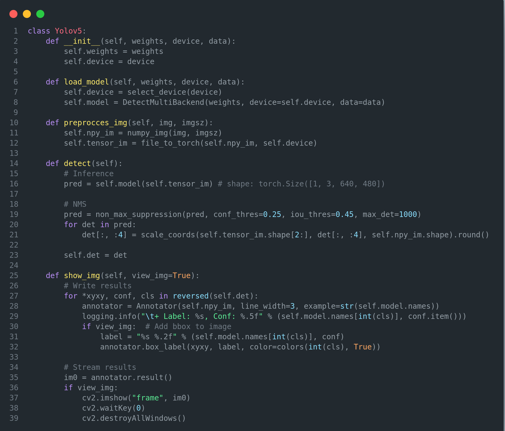
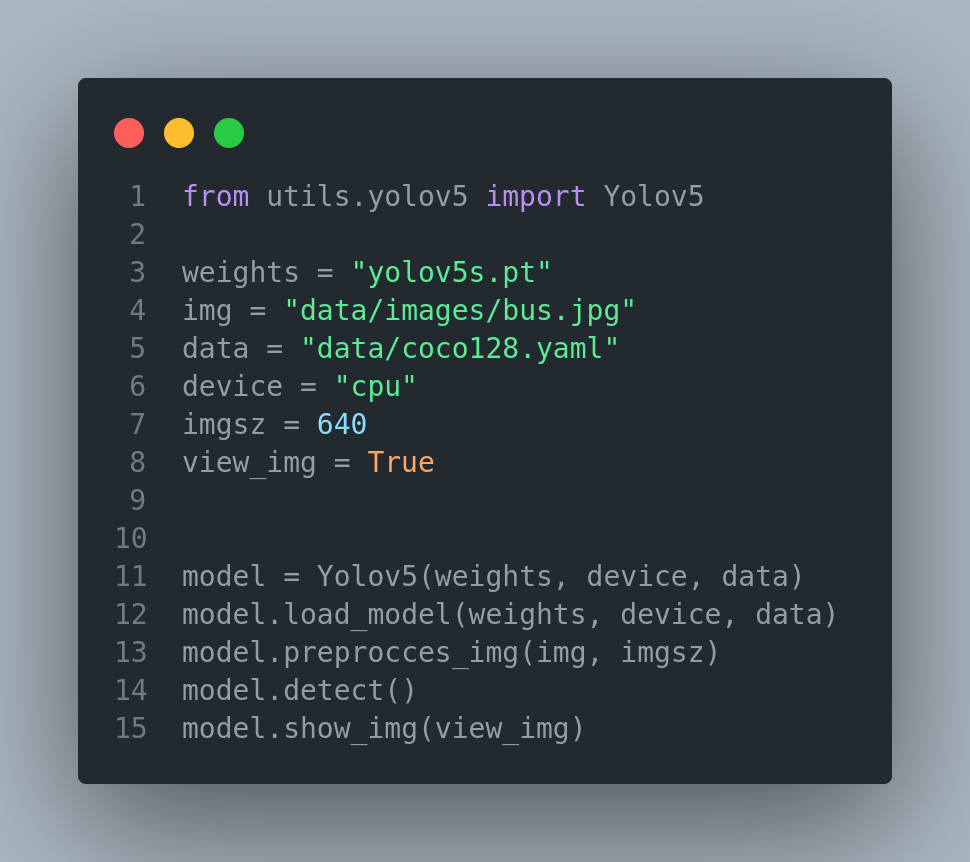

<div align="center">
<h1>
  Yolov5-Lite: Minimal YoloV5 Implementation
</h1>

</div>

## <div align="center">Overview</div>

It has been simplified by editing detect.py in the yolov5 repository.

### Installation

```
git clone https://github.com/kadirnar/yolov5-lite
cd yolov5-lite
pip install -r requirements.txt
```

## Yolov5-Lite Prediction: 
It is the edited version of the codes in the detect file.



## Yolov5-Lite Run Code:
You can take the detect.py file as an example to load and visualize your yolov5 models.



